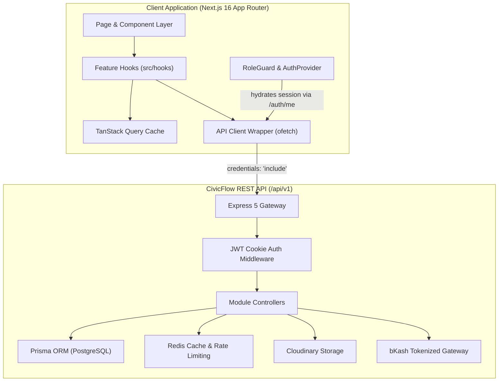
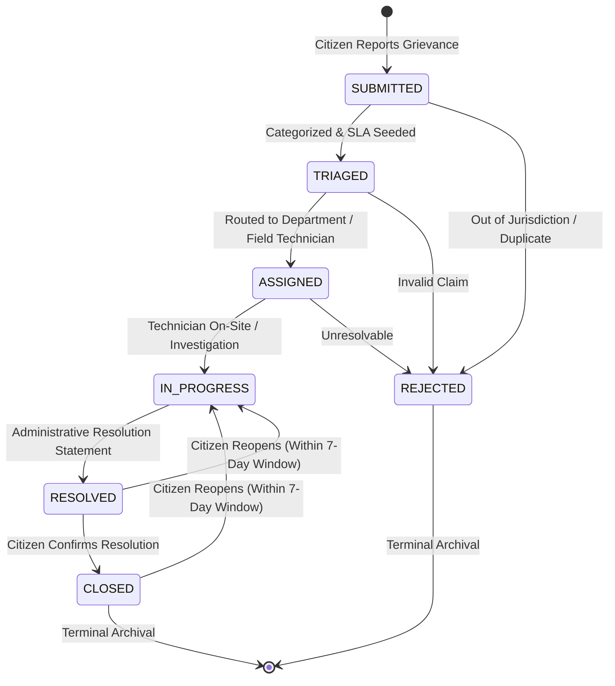
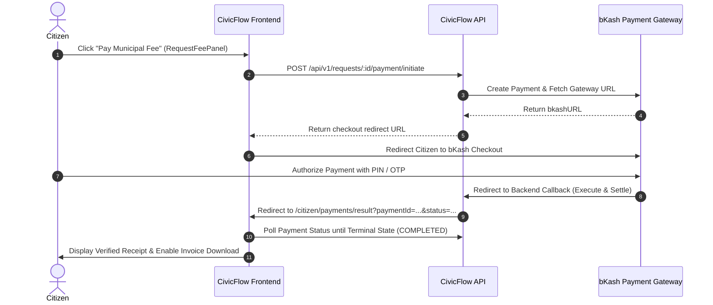

# CivicFlow Frontend

[](https://nextjs.org/)
[](https://react.dev/)
[](https://www.typescriptlang.org/)
[](https://tailwindcss.com/)
[](https://bun.sh/)
[](https://biomejs.dev/)
[](https://tanstack.com/query)

**CivicFlow** is an enterprise-grade, citizen-first municipal service intake, grievance redressal, and SLA governance web application. It bridges the gap between urban residents and municipal field departments through high-precision geotagged reporting, photographic evidence capture, transparent operational tracking, SLA breach escalation, and citizen-verified resolution.

This repository houses the modern frontend application built with **Next.js 16 (App Router)**, **React 19**, and **Tailwind CSS v4**, communicating with the CivicFlow REST API.

---

## Quick Navigation

- [Product Overview](#product-overview)
- [System Architecture](#system-architecture)
- [Deterministic State Machine](#deterministic-state-machine)
- [Implemented Portals & Features](#implemented-portals--features)
- [Application Routes](#application-routes)
- [Technology Stack](#technology-stack)
- [Demo Credentials](#demo-accounts)
- [Getting Started](#getting-started)
- [Environment Variables](#environment-variables)
- [Backend Integration & Authentication](#backend-integration--authentication)
- [Municipal Payments (bKash)](#municipal-payments-bkash)
- [Project Structure](#project-structure)
- [Development Workflow](#development-workflow)
- [Quality Assurance & Verification](#quality-assurance--verification)
- [Accessibility & Design Principles](#accessibility--design-principles)
- [Implementation Audit](#implementation-audit)
- [Troubleshooting](#troubleshooting)
- [Related Documentation](#related-documentation)

---

## Product Overview

CivicFlow addresses the core bottlenecks of urban municipal administration: lost grievances, opaque field progress, missed service deadlines, and unresolved citizen complaints.

A citizen can report municipal failures (e.g., waste overflow, defective street lamps, potholes, open drainage, waterlogging) in under 60 seconds with exact GPS coordinates and photographic proof. Once submitted, the ticket enters an automated triage and routing pipeline, visible to department crews and administrators. Upon completion, resolution is gated by the citizen's personal verification—with an unconditional 7-day reopening right if work is deficient.

### Core Architectural Principles

1. **Zero-Friction Intake:** Reporting is optimized for field-ready mobile browsers with 1-tap geolocation capture and client-side WebP image optimization.
2. **Radical Transparency:** Assigned technician, SLA countdown timers, routing rationale, and immutable state audit trails are openly visible.
3. **Ground-Truth Verification:** Evidence photos and precise coordinates govern both the initial report and final resolution audit.
4. **Resilient Public Service:** High-contrast outdoor readability, strict WCAG AA color accessibility, full keyboard navigation, and optimistic UI updates.

---

## System Architecture

CivicFlow is organized around client-side data orchestration powered by **TanStack Query v5**, custom feature API abstractions, and HTTP-only cookie-based authentication.



### Data Flow & Cache Lifecycle

1. **Route Mount:** Pages hydrate server-cached or freshly requested data through declarative hooks (e.g., `useGetServiceRequestById`, `useGetNotifications`).
2. **Unified Transport:** Requests are piped through `src/lib/apiClient.ts`, which automatically normalizes base URLs, handles JSON payloads, and attaches browser credentials (`credentials: "include"`).
3. **Envelope Parsing:** API responses conform to the standard CivicFlow contract:
   ```json
   {
     "success": true,
     "statusCode": 200,
     "message": "Operation executed successfully",
     "data": {},
     "meta": { "page": 1, "limit": 10, "total": 42, "totalPages": 5 }
   }
   ```
4. **Optimistic Mutations:** State changes (e.g., mark notification read, status transitions) update the local cache optimistically and trigger targeted query invalidation on settlement.

---

## Deterministic State Machine

CivicFlow tickets strictly follow the municipal state machine defined in the backend core service:



### State Definitions

| State | Operational Meaning | Permitted Actors |
| :--- | :--- | :--- |
| `SUBMITTED` | Grievance received into public intake pool; awaiting review. | Citizen |
| `TRIAGED` | Priority classified, SLA timer started, and target department identified. | Admin |
| `ASSIGNED` | Assigned to a specific field technician or department work roster. | Admin, Staff |
| `IN_PROGRESS` | Active field investigation, repairs, or sanitation works underway. | Staff, Admin |
| `RESOLVED` | Municipal work complete; awaiting citizen verification. | Admin |
| `CLOSED` | Resolution verified by citizen or automatically sealed. | Citizen |
| `REJECTED` | Deemed invalid, duplicate, or outside municipal jurisdiction with justification. | Admin |

> [!NOTE]
> Resolving a grievance (`IN_PROGRESS` &rarr; `RESOLVED`) represents an executive municipal decision strictly restricted to municipal administrators (`ADMIN`). Field technicians record investigation notes and report findings.

---

## Implemented Portals & Features

The frontend covers all **64 tracked product workflows** across 4 key roles:

### 1. Public & Marketing Portal
- **Municipal Homepage:** Hero banner, live operational telemetry, trust guarantees, and intake calls to action.
- **Anonymous Tracking:** Quick grievance lookup by public Tracking Number (`REQ-YYYY-XXXXX`) without login.
- **Civic Charter:** Public SLA commitments, category-wise resolution benchmarks, and reopening rights.
- **Authentication Flows:** Registration with validation, email OTP verification, credential login with demo quick-fill, Google OAuth sign-in, and password recovery/reset.

### 2. Citizen Portal (`/citizen`)
- **Dashboard Overview:** Metric KPI chips, active ticket feeds, priority indicators, and SLA breach countdowns.
- **60-Second Intake Wizard (`/citizen/report`):**
  - Dynamic category picker with fee annotations.
  - GPS locator with reverse-geocoded coordinates and map navigation links.
  - 5-photo evidence upload zone with client-side WebP compression.
  - Real-time client Zod schema validation.
- **Grievance Dossier (`/citizen/requests/[id]`):**
  - Interactive state transition timeline.
  - Staff investigation notes feed.
  - Evidence photo gallery and geospatial summary.
  - Ticket editing and cancellation/deletion (when eligible).
  - One-click resolution confirmation.
  - 7-day case reopening modal with mandatory reason prompt.
  - 5-star service satisfaction rating and feedback form.
- **Revenue & Invoicing (`/citizen/payments`):**
  - bKash Tokenized Gateway payment initiation.
  - Automated status polling upon gateway return.
  - Filterable payment ledger and official PDF invoice receipts.
- **Profile & Account:** Profile photo upload with drag-and-drop, name updates, and unclipped role badges.

### 3. Department Staff Field Desk (`/staff`)
- **Work Queues:** Dual-tab workspace for **Personal Assigned Queue** vs. **Department-Wide Queue**.
- **Field Filters:** Quick filtering by operational state (`ASSIGNED`, `IN_PROGRESS`), urgency tier, and search query.
- **SLA Monitor:** Visual alert banners for incidents nearing breach or overdue.
- **Field Workbench (`/staff/requests/[id]`):**
  - Incident dossier and evidence photo viewer.
  - 1-click Google Maps coordinate navigation.
  - Field investigation notes editor with pre-canned template chips.
  - State machine transition controls (`ASSIGNED` &rarr; `IN_PROGRESS`).

### 4. Municipal Administrator Operations Desk (`/admin`)
- **Citywide Command Overview (`/admin`):**
  - Executive KPI summary cards (Total volume, SLA compliance %, Revenue, Pending Triage).
  - Department workload distribution widget.
  - Category grievance volume breakdown widget.
  - Financial velocity telemetry.
  - Complete operations table with search, role filters, and pagination.
- **Personnel & User Directory (`/admin/users`):**
  - Search, filter by role (`CITIZEN`, `STAFF`, `ADMIN`), status (`ACTIVE`, `BLOCKED`, `DELETED`), and department.
  - Role upgrades, department assignment, and soft-delete/deactivate modal.
- **Municipal Departments (`/admin/departments`):**
  - Department management (Create, Edit, Archive, Restore).
  - Interactive Staff Roster Modal to inspect and assign field personnel.
- **Automated Routing Rules (`/admin/routing-rules`):**
  - Category-to-Department routing rules with priority weightings.
  - Create, update, archive, and reactivate rules.
- **SLA Breach & Escalation Desk (`/admin/sla`):**
  - Overdue ticket tracking and breach telemetry.
  - Category SLA target configuration modal (minutes, hours, or days).
  - Supervisor manual escalation trigger.
  - Batch automated breach processing job execution.
- **Audit Trail Ledger (`/admin/audit-logs`):**
  - Immutable system activity logs.
  - Structured modal showing actor, action classification, IP, timestamp, and before/after diff metadata.
- **Citizen Feedback Reports (`/admin/feedback-reports`):**
  - Citizen satisfaction telemetry, average rating distribution, and dissatisfaction alerts.
- **Municipal Ledger (`/admin/payments`):**
  - Citywide transaction ledger, payment gateway status reconciliation, and administrative receipts.

---

## Application Routes

| Route | Role Access | Purpose |
| :--- | :---: | :--- |
| `/` | Public | Public portal homepage with live statistics and tracking modal |
| `/about-us` | Public | Civic charter, SLA commitments, and policies |
| `/login` | Public | Credentials sign-in with demo quick-fill & Google OAuth |
| `/register` | Public | Citizen account registration |
| `/account-verify` | Public | OTP 6-digit email address verification |
| `/forgot-password` | Public | Password recovery request |
| `/reset-password` | Public | New password definition using email reset token |
| `/unauthorized` | Public | Access denied guard page with safe redirect actions |
| `/citizen` | `CITIZEN` | Citizen dashboard with grievance list and SLA telemetry |
| `/citizen/report` | `CITIZEN` | 60-second incident intake wizard |
| `/citizen/requests/[id]` | `CITIZEN` | Complete grievance dossier, verification loop, and feedback |
| `/citizen/payments` | `CITIZEN` | Payment history and checkout desk |
| `/citizen/payments/[paymentId]` | `CITIZEN` | Payment transaction receipt and official invoice |
| `/citizen/payments/result` | `CITIZEN` | bKash payment gateway return reconciliation page |
| `/staff` | `STAFF` | Personal and department field queues |
| `/staff/requests/[id]` | `STAFF` | Field technician workbench, GPS navigator, and notes editor |
| `/admin` | `ADMIN` | Executive command center and triage workbench |
| `/admin/users` | `ADMIN` | Personnel, staff, and citizen directory |
| `/admin/departments` | `ADMIN` | Department management and staff deployment rosters |
| `/admin/routing-rules` | `ADMIN` | Automated routing rules and dispatch pipelines |
| `/admin/sla` | `ADMIN` | SLA breach desk, duration configuration, and escalation |
| `/admin/audit-logs` | `ADMIN` | Immutable system audit log trail |
| `/admin/feedback-reports` | `ADMIN` | Citizen satisfaction ratings and analytical reports |
| `/admin/payments` | `ADMIN` | Citywide revenue ledger and gateway transaction audit |
| `/admin/payments/[paymentId]` | `ADMIN` | Administrative payment transaction receipt |
| `/admin/requests/[id]` | `ADMIN` | Administrative grievance dossier and workflow control |

---

## Technology Stack

### Frontend Core
- **Framework:** Next.js `16.3.7` (App Router, Server & Client Components)
- **Library:** React `19.2.8`
- **Language:** TypeScript `5.0+`
- **Styling:** Tailwind CSS `v4` with custom CSS variables
- **Package Manager:** Bun `1.4.2`
- **Linter & Formatter:** Biome `2.4.2`

### State & Networking
- **Server State & Caching:** `@tanstack/react-query` `v5.104.0`
- **Forms & Validation:** `@tanstack/react-form` `v1.33.5`, Zod `v4.6.5`
- **HTTP Client:** `ofetch` `v1.5.1` (configured with `credentials: "include"`)
- **OAuth:** `@react-oauth/google` `v0.13.5`

### UI Components & Aesthetics
- **Primitives:** `@base-ui/react`, Radix / shadcn patterns
- **Icons:** `lucide-react` `v1.48.0`
- **Animations:** `framer-motion` `v14.0.0`, `tw-animate-css`
- **Notifications & Toasts:** `goey-toast` `v0.5.0`
- **Class Utilities:** `clsx`, `tailwind-merge` (`cn` helper)

### Companion Backend Infrastructure
- **API Runtime:** Node.js, Express 5, TypeScript
- **Database & Cache:** PostgreSQL, Prisma 7, Redis
- **Media & Invoicing:** Cloudinary, PDFKit
- **Payments:** bKash Tokenized Checkout API

---

## Demo Accounts

For rapid testing and evaluation, the backend seed populates these standard role accounts:

| Role | Email Address | Password | Clearance & Access Scope |
| :--- | :--- | :--- | :--- |
| `ADMIN` | `superadmin@example.com` | `Password@123` | Citywide triage, user control, SLA config, departments, audit logs |
| `STAFF` | `staff.drainage@civicflow.org` | `Password@123` | Department queues, investigation notes, state progression |
| `CITIZEN` | `citizen.sarah@example.com` | `Password@123` | Submit grievances, bKash payments, verify resolution, feedback |

> [!TIP]
> The login page at `/login` provides 1-click demo credential pills that instantly pre-fill email and password for any role.

---

## Getting Started

### Prerequisites

- [Bun](https://bun.sh/) `1.4.2+` (Recommended) or Node.js `20+`
- Running instance of the **CivicFlow Backend API** (locally at `http://localhost:5000` or deployed at `https://civic-flow-api.vercel.app`)

### 1. Clone & Install Dependencies

```bash
git clone https://github.com/asif-shahriar-tauhid/CivicFlow-Frontend.git
cd CivicFlow-Frontend
bun install
```

### 2. Configure Environment Variables

Create a `.env.local` file in the project root:

```dotenv
# Backend API Base URL (normalized automatically to include /api/v1)
NEXT_PUBLIC_API_BASE_URL=http://localhost:5000/api/v1

# Optional: Google OAuth Client ID for Google Sign-In
NEXT_PUBLIC_GOOGLE_CLIENT_ID=your-google-client-id.apps.googleusercontent.com
```

### 3. Launch Development Server

```bash
bun run dev
```

Open [http://localhost:3000](http://localhost:3000) to view the application.

---

## Environment Variables

Only browser-safe `NEXT_PUBLIC_` variables are utilized by the frontend:

| Variable | Required | Description | Default Fallback |
| :--- | :---: | :--- | :--- |
| `NEXT_PUBLIC_API_BASE_URL` | No | Base URL of the CivicFlow REST API. Automatically normalizes trailing slashes and `/api/v1`. | `https://civic-flow-api.vercel.app/api/v1` |
| `NEXT_PUBLIC_GOOGLE_CLIENT_ID` | Optional | Google Cloud OAuth Client ID for enabling Google login. | `undefined` (Credential login functions independently) |

> [!WARNING]
> Do NOT place backend database URLs, JWT secrets, bKash app secrets, or SMTP credentials in `.env.local`. All sensitive keys belong strictly in the backend repository.

---

## Backend Integration & Authentication

### HTTP-Only Cookie Mechanism

CivicFlow implements defense-in-depth authentication managed entirely by the backend:
- **Session Tokens:** `accessToken` (1-day validity) and `refreshToken` (7-day validity) are stored in secure HTTP-only cookies.
- **Credential Handling:** The frontend API client configures `credentials: "include"` on every request to pass cookies across origins.
- **Session Hydration:** Upon mounting, `AuthProvider` queries `/api/v1/auth/me`. If valid, the current user identity and clearance role are seeded into the TanStack Query cache.
- **Route Protection:** `RoleGuard` and layout wrappers verify that the active user matches required clearance levels, instantly rerouting unauthorized users to `/unauthorized` or `/login`.
- **CORS Notice:** For local development, the backend must whitelist `http://localhost:3000` in its CORS policy with `credentials: true`.

---

## Municipal Payments (bKash)

For service request categories requiring a statutory municipal fee (e.g., specialized demolition, commercial septic clearing, hazardous waste pickup), CivicFlow integrates the **bKash Tokenized Checkout** pipeline:



---

## Project Structure

```text
src/
├── api/                    # Typed REST API service functions (ofetch wrappers)
│   ├── auth.api.ts
│   ├── request.api.ts
│   ├── department.api.ts
│   ├── payment.api.ts
│   ├── notification.api.ts
│   ├── sla.api.ts
│   ├── auditLog.api.ts
│   └── user.api.ts
├── app/                    # Next.js App Router (Pages, Layouts, Route Groups)
│   ├── (dashboard)/        # Role-gated authenticated portal subtrees
│   │   ├── admin/          # Citywide admin operations desk
│   │   ├── citizen/        # Citizen grievance desk & intake wizard
│   │   └── staff/          # Field crew queues & investigation workbench
│   ├── (public)/           # Public views
│   │   ├── (authentication)/ # Login, Register, Verify, Forgot, Reset
│   │   └── (marketing)/    # Homepage and About Us / Charter
│   ├── globals.css         # Tailwind v4 theme tokens & glassmorphism utilities
│   ├── layout.tsx          # Root provider shell & HTML scaffold
│   ├── not-found.tsx       # 404 recovery page
│   └── unauthorized/       # Access denied resolution page
├── asset/                  # Brand SVG marks, vector badges, and iconography
├── components/             # Reusable and modular component architecture
│   ├── common/             # UserAvatar, RoleGuard, Spinner, StatusBadges
│   ├── form/               # TanStack Form + Zod input modules
│   ├── layouts/            # DashboardHeader, Sidebar, Public Header/Footer
│   ├── modules/            # Feature-specific composite modules
│   │   ├── admin/          # SLA modals, user management, audit tables
│   │   ├── home/           # Telemetry banner, service grid, quick tracker
│   │   ├── payments/       # Fee panels, receipts, invoice viewers
│   │   ├── profile/        # Avatar uploader, settings dialog
│   │   └── requests/       # Transition controls, notes, assign modals
│   └── ui/                 # Atomic design primitives (Button, Card, Dialog, Badge)
├── constants/              # State machine graphs, transitions, mock fallbacks
├── hooks/                  # TanStack Query query/mutation hooks
├── lib/                    # apiClient, authUtils, imageUtils, paymentUtils
├── providers/              # AuthProvider, QueryProvider, GoogleOAuthProvider
├── types/                  # Authoritative TypeScript interfaces & domain models
└── validation/             # Client-side Zod schemas for all user inputs
```

---

## Development Workflow

### Adding a New Feature

When extending CivicFlow, follow this predictable 8-step pipeline:

1. **Define Schema & Types:** Update domain interfaces in `src/types/` and validation schemas in `src/validation/`.
2. **API Endpoint Function:** Add the typed API caller to `src/api/<feature>.api.ts` utilizing `apiClient`.
3. **Query/Mutation Hook:** Implement the TanStack Query hook in `src/hooks/<feature>.hooks.ts` with explicit query keys and invalidation logic.
4. **Build Component/Page:** Implement the UI under `src/components/modules/` or the corresponding App Router route.
5. **State Feedback:** Provide clean skeleton loaders, error callouts, empty states, and toast notifications.
6. **Responsive Audit:** Verify mobile drawer behavior, touch targets (&ge; 44px), and desktop viewports.
7. **Typecheck & Lint:** Run `bun x tsc --noEmit` and `bun run lint`.

---

## Quality Assurance & Verification

The project includes strict automated formatting, linting, and TypeScript compilation:

| Command | Purpose | Underlying Tool |
| :--- | :--- | :--- |
| `bun run dev` | Starts local Next.js development server with hot reload | Next.js App Router |
| `bun run build` | Builds optimized production bundle | Next.js Compiler |
| `bun run start` | Serves production build | Next.js Server |
| `bun run lint` | Runs comprehensive codebase linting | Biome `2.4.2` |
| `bun run format` | Formats code in place according to design rules | Biome Formatter |
| `bun x tsc --noEmit` | Strict type verification across all modules | TypeScript `5.0+` |

---

## Accessibility & Design Principles

CivicFlow adheres to the design specifications defined in `DESIGN.md`:

- **Outdoor Contrast:** Body copy and status badges maintain a minimum 4.5:1 contrast ratio against light and dark backdrops (WCAG AA).
- **Geometry & Hierarchy:** Buttons, search pills, filter tabs, and status badges use curved pill geometry (`rounded-full`), while data tables, dialogs, and structural cards use refined architectural radii (`rounded-2xl`).
- **Tabular Data:** Ticket identifiers (`REQ-2026-00101`), GPS coordinates, monetary figures (BDT ৳), and countdown clocks use monospace tabular numerals (`font-mono`).
- **Responsive Navigation:** Desktop features an expandable/collapsible sidebar with persistent state; mobile uses an accessible slide-over drawer with backdrop blur and touch dismiss.
- **Evidence Compression:** User-submitted camera attachments are automatically converted to optimized WebP images on the canvas before dispatch, saving user mobile bandwidth.

---

## Implementation Audit

| Module Area | Tracked Features | Completed | Status |
| :--- | :---: | :---: | :---: |
| **Authentication & Profile** | 10 | 10 | 🟢 Complete (100%) |
| **Citizen Portal & Reporting** | 14 | 14 | 🟢 Complete (100%) |
| **Payments & Invoicing (bKash)** | 7 | 7 | 🟢 Complete (100%) |
| **Department Staff Field Desk** | 10 | 10 | 🟢 Complete (100%) |
| **Municipal Administrator Desk** | 16 | 16 | 🟢 Complete (100%) |
| **Notifications & Subscriptions** | 3 | 3 | 🟢 Complete (100%) |
| **Public & Marketing Surface** | 4 | 4 | 🟢 Complete (100%) |
| **Total Workflows Implemented** | **64** | **64** | 🟢 **100% Production Ready** |

*For granular endpoint-to-component mappings, refer to [implementation_status_tracker.md](implementation_status_tracker.md).*

---

## Troubleshooting

### 1. API Requests Fail with Network Error
- Verify the backend server is running and accessible at the URL in `NEXT_PUBLIC_API_BASE_URL`.
- Confirm backend CORS configuration explicitly permits `http://localhost:3000` with credentials enabled.

### 2. Session Hydration Stuck / Role Guard Redirect Loops
- Ensure third-party cookies or cross-site tracking protections in the browser are not discarding HTTP-only cookies if running on disparate local ports.
- Verify that your local API URL in `.env.local` points to port `5000` and not port `3000`.

### 3. Remote Evidence Photos Fail to Load
- Next.js requires remote image domains to be declared in `next.config.ts`.
- The configuration currently allows `res.cloudinary.com`. If using a different storage bucket, add the remote pattern to `next.config.ts`.

### 4. Google Sign-In Button Inactive
- Confirm `NEXT_PUBLIC_GOOGLE_CLIENT_ID` is defined in `.env.local`.
- Ensure `http://localhost:3000` is added under **Authorized JavaScript origins** in your Google Cloud Console OAuth Client credentials.

---

## Related Documentation

- [Product Specification (`PRODUCT.md`)](PRODUCT.md) — Comprehensive functional requirements, persona definitions, and domain rules.
- [Design System Guide (`DESIGN.md`)](DESIGN.md) — Visual tokens, typography scales, pill geometry rules, and UI guidelines.
- [Backend Architecture Overview (`backend_overview.md`)](backend_overview.md) — Express 5 controllers, Prisma models, Redis keys, and API contracts.
- [Endpoint & UI Audit Tracker (`implementation_status_tracker.md`)](implementation_status_tracker.md) — Exhaustive checklist of all 64 implemented backend endpoints and matching frontend views.

---

&copy; 2026 CivicFlow Municipal Systems. Designed for urban public service excellence.
